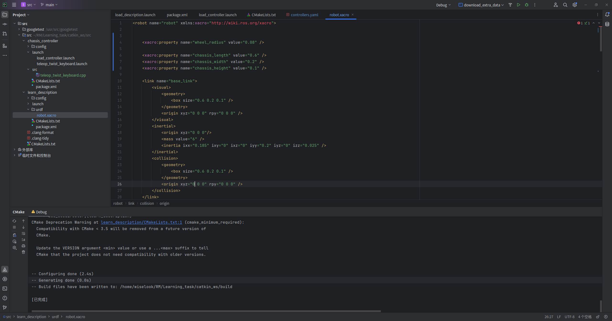
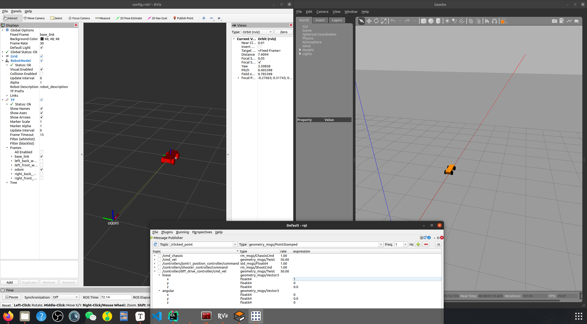

# 学习心得

学到了如何编写URDF

学会了使用xacro更好地编写URDF

了解了ros_control是如何和gazebo进行交互的

学会了移植ros官方插件控制器

学习了代码规范

## URDF编写

urdf就是用于仿真中描述机器人物理特性及外观特性的一种XML 格式文件



## 控制器使用

采用了ros_control官方的差速底盘控制器

http://wiki.ros.org/diff_drive_controller



小车自转运动有些问题，初步排查认为是参数设置不合理导致。

## Gazebo和URDF的联系

通过ros官方提供的包gazebo_ros，可以联系起两者，调用spawn_model即可生成模型在Gazebo中。

## 获得URDF参数

若要获得urdf的参数，可参考下面代码

```c++
const std::string model_param_name = "robot_description";
    bool res = root_nh.hasParam(model_param_name);
    std::string robot_model_str="";
    if (!res || !root_nh.getParam(model_param_name,robot_model_str))
    {
      ROS_ERROR_NAMED(name_, "Robot description couldn't be retrieved from param server.");
      return false;
    }

    urdf::ModelInterfaceSharedPtr model(urdf::parseURDF(robot_model_str));

    urdf::JointConstSharedPtr left_wheel_joint(model->getJoint(left_wheel_name));
    urdf::JointConstSharedPtr right_wheel_joint(model->getJoint(right_wheel_name));
```
