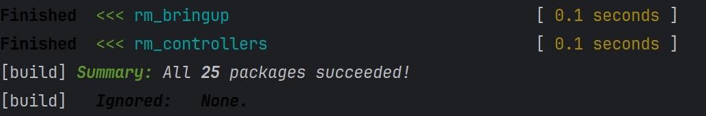
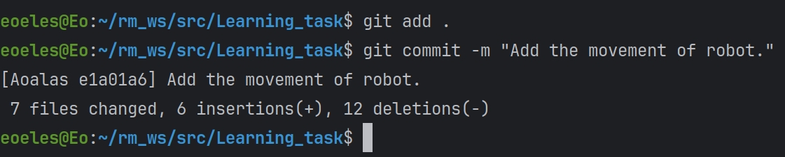
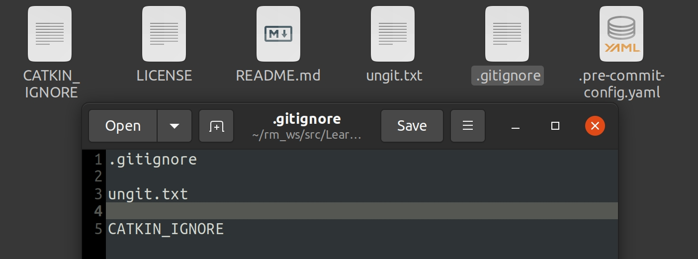
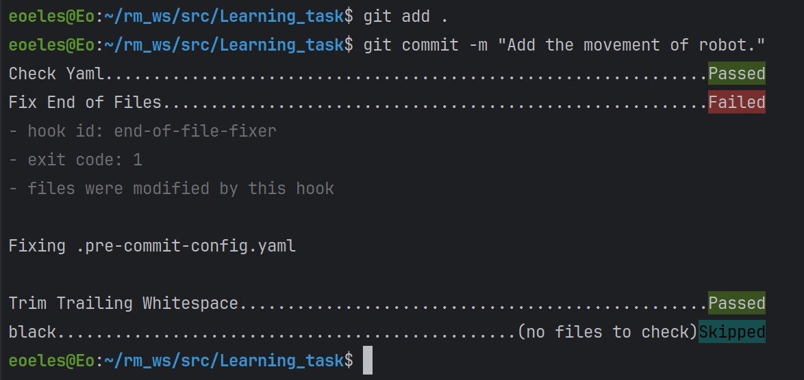
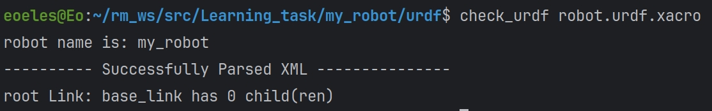
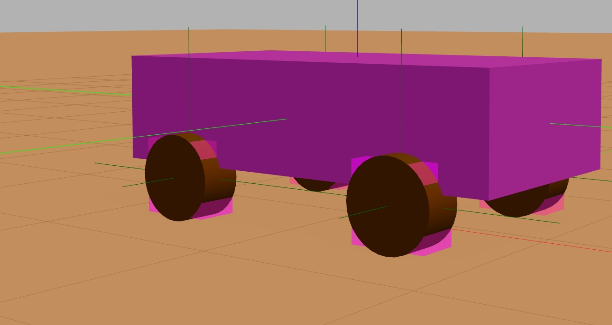
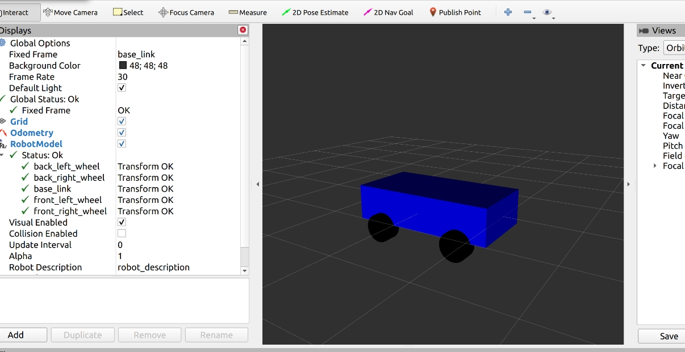
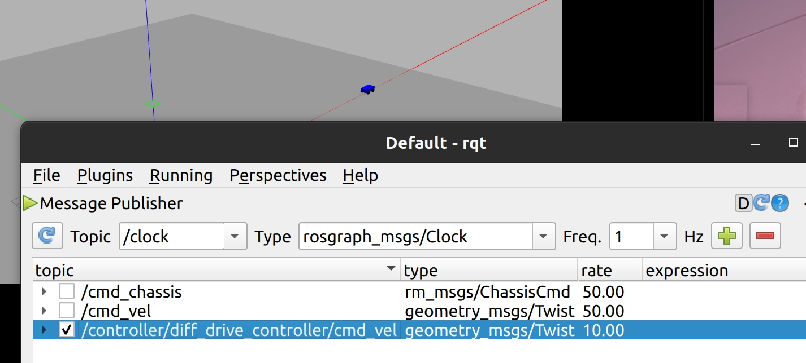

# Learning_task about urdf

Author:刘焯林

这份md文档记录了该urdf练习的完成情况，以下为完成成果以及大概的制作流程。

### catkin_build的使用

使用create_pkg直接在工作空间里建立一个新的软件包，配置好cmakelist等文件即可，操作较为简单，就不进行赘述。

### git操作

在Clion中进行简单的git操作，commit信息符合规范，同时也可以通过clion进行commit信息的修改和commit操作的撤回删除。

### gitignore的使用

新建一个名为.gitignore的文件，将不需要commit的文件的名称写入即可。

### pre-commit的使用

根据队内文档安装使用pre-commit，规范文件内容。

### check_urdf

如图所示，此命令可对urdf文件进行检查

但由于这主要针对的是.urdf后缀的文件，对于现在使用的.xacro文件，使用rosrun xacro xacro 命令效果更佳，如果出现语法错误则会进行提示。

### urdf的模型制作

小车模型采用一个长方体和四个圆柱体拼接的方式进行

由于urdf文件使可以直接使用基本的长方体和圆柱体的，先创建一个link名为base_link，并在其中根据urdf语法创建一个长方体，完善碰撞箱，惯量矩阵等要素，再创建各个轮子的link像长方体一样完善。 (由于小车轮子的属性和位置关系具有对称性，urdf内使用宏xacro来简化代码，joint等同理)

创建joint并确定好父子级，将base_link和各个轮子的link连接起来，实现模型的拼接，由于圆柱体在创建之初圆底朝上，我们可以选择在圆柱创建时旋转或者将joint旋转，这里选择将joint旋转，其type为continuous即为可旋转，可旋转意味着要选择 一个轴，由于joint旋转则这里的轴应该为z轴，这样轮子就只会在正确的方向上旋转，同时也不会向外倾斜。完成建模后将其包含在一个launch文件中，使用对应的代码使其能够读取指定的urdf，再启动这个launch文件即可查看。

根据创建的长方体和圆柱体对数据进行不断调整，让joint处于合理的位置，如下图所示，

可见各物体之间位置，碰撞箱，惯量矩阵均正确。

### rviz中的显示

完成小车拼接的同时，也为小车的各个部分进行上色，车体为蓝车轮为黑，rviz的Fixed Frame里选择base_link，能正确显示物体间的位置关系，大小和颜色。

### 控制小车移动

小车模型创建完成后，我们需要想办法让其自发的动起来，这里使用了diff_drive_controller和joint_state_controller两种控制器，先创建一个yaml文件根据物体属性配置好两个控制器，                   再将yaml文件写入launch文件，并在launch文件中包含joint_state_publisher，robot_state_publisher, controller_spawner三种node。

其中controller_spawner的type为spawner，arg为controller/diff_drive_controller和controller/joint_state_controller，对应上文的控制器。

由于我们使用了上述控制器，所以不要忘记在gazebo部分适用插件ros_control,使其能与gazebo联系，否则gazebo里面的小车是没有反应的。

~~因为transmission部分为非必要，所以就不讲了具体看代码~~

接下来启动对应的launch文件，里面的小车便可以自发的运动了。

由于使用了diff_drive_controller，启动模型后往controller/diff_drive_controller/cmd_vel上发布命令，或者打开rqt进行命令发布即可。**（注意不是/cmd_vel）**

linear.x部分可使其前进或后退，angular.z可以使其转向。

## 总结

先建立好urdf模型，再调用控制器使小车能够运动，需要在yaml文件内配置好控制器并在launch文件里面实现，同时也不能忘记在urdf中调用插件，成功启动模型后向正确的话题中根据消息类型输入数据即可实现控制。

此task中采用了大量的宏(xacro)操作，urdf文件分为两份，wheel.urdf.xacro存放宏的具体内容，robot.urdf.xacro中include了前者以此调用宏实现功能，宏的使用简化了代码，尤其使轮子创建这一重复性过程，具体实现详见代码内容。
